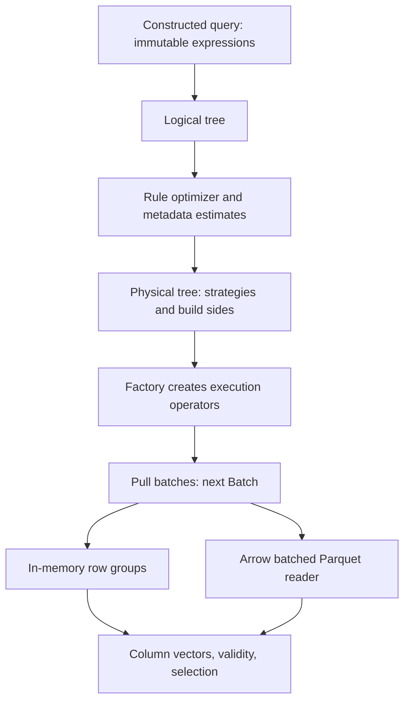

# Architecture and tradeoffs

## Batch contract

`Batch::physical_size` counts initialized rows in every column. `selection.size()`
counts active rows, and each selection entry is an index below `physical_size`.
Selections can be implicit identity ranges or contiguous `uint16_t` indices.
The configurable execution capacity is 1–65,535 rows (default 2,048). Empty-schema
batches still carry a row count, which is necessary for pruned `COUNT(*)` plans.

Columns hold contiguous int64, double, byte-valued booleans, or uint32 offsets
into a contiguous string arena. Validity uses one bit per row, with one meaning
valid. NULL payload bytes have no semantic meaning. Reset retains buffer
capacity. Strings may include embedded NUL bytes. A string arena is limited to
4 GiB; execution row counts and blocking payload row IDs are separate concepts.

Every output batch owns its values. Scan and projection materialize output;
filter changes only the selection. This costs copying but makes lifetime rules
explicit: consumers can retain a batch by copying it, and producers can reuse
their buffers on the next call. `Evaluator::evaluate` returns a borrowed column
reference valid until input mutation or the next evaluation. Column-reference
expressions return the input vector directly; computed nodes reuse scratch.

## Execution

The pull interface calls `next(Batch&)` once per batch. It makes operator
composition, early LIMIT termination, and continuation through duplicate join
chains easy to inspect. It avoids virtual dispatch per tuple at normal batch
sizes. It is single-threaded and does not fuse expressions across operators.
Push pipelines could reduce intermediate materialization and coordinate
parallelism; they would require scheduler and pipeline lifetime machinery not
needed for this implementation.

Expressions are compiled to postorder nodes with bound column positions and
reusable vectors. Each node evaluates over a selection, rather than interpreting
an AST for each row. Scalar NULL-aware loops are the general path. Dense,
all-valid int64 `< constant` and double addition use isolated dispatchable
kernels. No query-wide `-mavx2` flag is required.

## Hashing and blocking operators

The shared hash index uses 16-byte buckets containing a 64-bit hash and a payload
row ID. It starts at 16 buckets, maintains at most 70% occupancy, resolves
collisions by linear probing with full key equality checks, and doubles and
rehashes on growth. Payload is separate from the index to keep unsuccessful
probes from touching aggregate state or joined rows. Hashes are deterministic;
this is not a hash-flood-resistant service boundary.

Aggregation stores composite keys in columnar arrays and aggregate states in a
contiguous group-major array. State consists of numeric accumulators and seen/
overflow flags. New keys can grow buffers; existing groups require no per-row
heap allocations. SQL NULL grouping, COUNT(*), COUNT(column), SUM, MIN and MAX
are supported. MIN/MAX and SUM accept numeric inputs; grouping accepts all
supported types. Empty global aggregation yields one row; empty grouped
aggregation yields none.

The inner join stores build payload in columns and duplicate links in contiguous
row-index arrays. NULL or NaN keys never enter the build index. Probe heads are
found for an entire input batch before duplicate chains are expanded. The
continuation records the probe row and duplicate link, so a single key can
produce more than one output batch. Switching build sides preserves the public
left-then-right schema, but does not promise row order.

Sort materializes column payload, stable-sorts an array of row IDs, then emits
batches. LIMIT is streaming; a LIMIT above sort still requires a full sort.
All blocking state is in memory: no spilling, memory quota, parallel partitioned
join, or external sorting. Allocation failure propagates as an exception.

## Planning and optimization

Logical nodes describe relational operations; physical nodes describe selected
strategies. Execution operators are created only after optimization and
lowering. Expressions are immutable; optimization deep-copies the logical tree.
Globally unique column IDs allow schemas to shrink without rebinding expressions
by fragile old positions. Self-joins require distinct column IDs for each input.

Rules fold constant expressions using the actual evaluator; simplify boolean
identities and double negation; deduplicate filters; remove identity projections;
push side-local predicates through inner joins, grouping-key predicates through
aggregation, predicates through sort and column-only projections; and prune
unused columns and aggregates. LIMIT and global aggregation are semantic
barriers. Computed projections are conservatively kept as pushdown barriers.
`x=x` and `x*0` are deliberately not simplified, because of NULLs, NaNs and
overflow. Exact filters remain above scans even when metadata can skip groups.

Statistics include exact row/null counts and min/max, plus a 1,024-bit linear
counting sketch for in-memory distinct-count estimates. Saturated sketches fall
back to non-NULL row counts; Parquet cardinality also uses that fallback.
Selectivity estimates assume uniform numeric ranges or equal key frequencies.
Filters run in estimated selectivity order. Join lowering chooses the smaller
estimated input by row count; it does not estimate payload bytes, search join
orders, or implement a calibrated cost model. Join output cardinality uses a
crude max-input heuristic. Skew and correlated columns can make these estimates
poor, without affecting correctness.

## Storage

`Source` separates immutable metadata from scan cursors. MemorySource and
ParquetSource share the planner interface. In-memory batches are row groups with
min/max metadata. The Parquet source reads the footer, selects candidate row
groups, requests only required physical columns from Arrow, then converts
bounded Arrow record batches into owned engine columns. It supports flat bool,
int64, double and UTF-8 columns. Unsupported nested/logical/numeric types fail
explicitly. Input files must remain unchanged between metadata construction and
scan execution.

Missing bounds retain groups. Missing NULL counts retain groups for IS NULL.
Parquet bounds cannot prove absence of NaN, so `!=` pruning for double columns
is conservative. Metadata pruning may admit false positives but must never
drop qualifying rows. A zero-column scan obtains cardinality from metadata
without decoding value columns. There is no custom Parquet parser, page-index
pruning, asynchronous prefetch, dictionary-preserving execution or scan cache.

## Numeric and NULL semantics

Boolean logic uses SQL's three truth values. WHERE retains only valid true.
Comparisons with NULL yield NULL. Integer arithmetic is checked; overflow and
division by zero yield NULL. Integer division truncates toward zero. An int64
SUM becomes NULL if any intermediate accumulator overflows. COUNT overflow
throws. Double arithmetic uses IEEE values except division by either signed
zero yields NULL. No implicit numeric casts are performed.

Comparisons retain IEEE NaN behavior. For grouping, NaNs form one group and
positive/negative zero share a group. NaN never matches an equality join key.
Sort and numeric MIN/MAX use an order where NaN follows other non-NULL doubles;
NULL placement in sort is independent of ascending/descending order. SUM follows
input order and is not compensated, so different valid join orders can change
floating-point rounding. Strings use bytewise lexicographic comparisons with no
locale or collation processing.

## Measurements and alternatives

`allocated_bytes()` reports retained capacities for data, validity, selection,
hash buckets, numeric state, row links and execution scratch. It includes child
operators recursively and excludes shared input tables. The benchmark reports
input-table column buffers separately and includes the output batch in its
operator-buffer counter. These are concrete buffer measurements, not full heap
accounting: schema strings, expression objects, STL control objects, allocator
metadata and sort's temporary workspace are not included. Parquet scans use an
Arrow proxy memory pool for their current decoder allocation count.

std::unordered_map per group was rejected in favor of contiguous buckets and
states. Per-row strings were rejected in favor of offset arenas. A full SQL
frontend, an elaborate inheritance hierarchy for expressions, and a homemade
Parquet parser would distract from execution. Prefetching, SIMD hash probing,
Top-N, late materialization and parallel execution remain future experiments,
not existing features.
